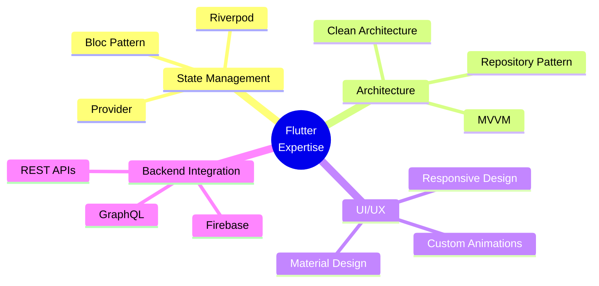

# 👋 Hey there! I'm Chanidu Madalagama

<div align="center">
  
</div>

<div align="center">
  
</div>

## 🚀 About Me

```dart
class DeveloperProfile {
  final String name = "Chanidu Madalagama";
  final String role = "Senior Flutter Developer";
  final int experience = 4; // years
  final String location = "Sri Lanka 🇱🇰";
  
  List<String> currentFocus = [
    "Dating App Development",
    "Flutter Architecture Patterns",
    "State Management Solutions",
    "Performance Optimization"
  ];
  
  List<String> techStack = [
    "Flutter", "Dart", "Firebase",
    "REST APIs", "State Management",
    "Native Android", "iOS Development"
  ];
}
```


### 🔥 What I'm Up To

- 🚀 **Currently Building:** A sophisticated Dating App with advanced matching algorithms
- 📚 **Learning:** Advanced Flutter patterns, Riverpod, and Clean Architecture
- 🤝 **Open to Collaborate:** Mobile app projects using Flutter & React Native
- ✍️ **Content Creator:** Writing technical articles on [Medium](https://medium.com/@chanidumadalagama)
- 💡 **Ask Me About:** Flutter widgets, app architecture, and mobile UI/UX

### 📫 Let's Connect!

<div align="center">

[](mailto:chanidumadalagama@gmail.com)
[](https://linkedin.com/in/chanidu-madalagama)
[](https://twitter.com/chanidum)
[](https://medium.com/@chanidumadalagama)
[](https://instagram.com/chanidumadalagama)

</div>

## 💻 Tech Stack

<div align="center">

### 🎯 Mobile Development


### 🗄️ Backend & Database


### 🌐 Web Technologies


### 🛠️ Tools & Others


</div>

## 📊 GitHub Analytics

<div align="center">
  
  
</div>

<div align="center">
  
</div>

## 🏆 GitHub Trophies

<div align="center">
  
</div>

## 📈 Contribution Graph

<div align="center">
  
</div>

## 🎯 Current Focus Areas

<div align="center">



</div>

## 💡 Fun Developer Fact

> 💻 **Did You Know?** The first mobile phone call was made on April 3, 1973, by Martin Cooper, a Motorola executive. Fast forward 50+ years, and now we're building sophisticated apps that can do everything from AI-powered matching algorithms to real-time video calls - all in your pocket! 📱✨

## 🔥 Recent Activity

<!--START_SECTION:activity-->
<!--END_SECTION:activity-->

---

<div align="center">
  
### 🌟 "Code is like humor. When you have to explain it, it's bad." - Cory House


**Thanks for visiting! Let's build something amazing together! 🚀**

</div>

<!--
**Profile Views Counter**
-->
<div align="center">
  
</div>
